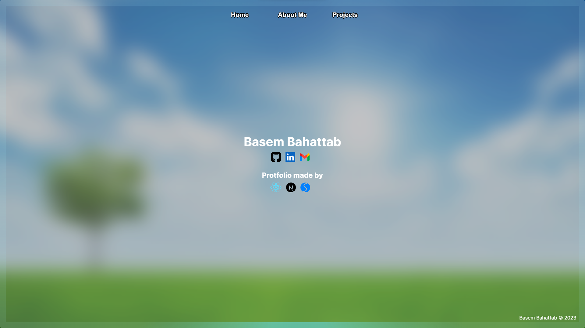
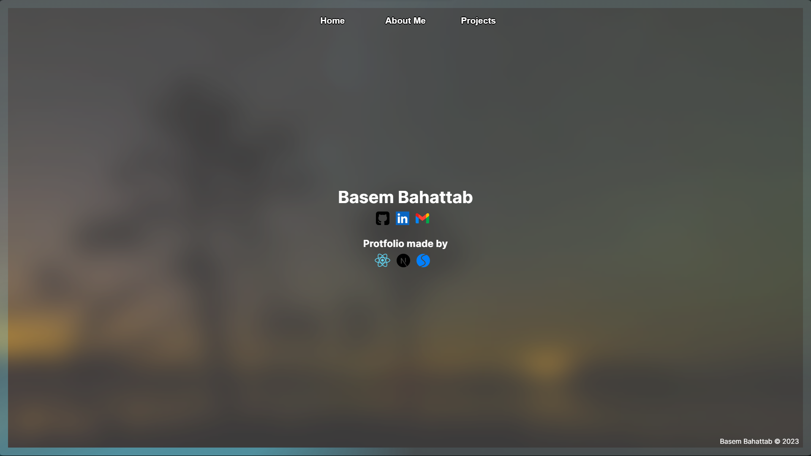

<h1 align="center">This is protfolio website.</h1>  
<h3 align="center">A nice clean Portfolio Website. Which contain must of the information you need to know. The UI on the website responsive to must screens.</h3>  

## You are welcome to try:
<a href="https://basembahattab-profolio.vercel.app/">Click to try.</a>

-  The website contains:
	- Background based on time: I used new  Date() to get the current time for the user and change background based on day time or night time.
         
	- Swipers library: Enhance the UI and UX to display slides.
    - 
	- Border animation: 
	- Border fade in animation:
	- Lazy loading: Reduce the images loading that are not in the front page.
  
- 📄 Know about my experiences:
	- My Resume is included in About Me page.
  
<h3 align="left">Languages and Tools:</h3>  
<p align="left"> <a href="https://nextjs.org/" target="_blank" rel="noreferrer"> - Next.js </a> <a href="https://reactjs.org/" target="_blank" rel="noreferrer"> React.js </a>  
<a href="https://swiperjs.com/" target="_blank" rel="noreferrer"> Swiper.js </a> </p>

## Test the code locally

First, clone the project then run the development server:

```bash
npm run dev
# or
yarn dev
# or
pnpm dev
```

Open [http://localhost:3000](http://localhost:3000) with your browser to see the result.

You can start editing the page by modifying `app/page.js`. The page auto-updates as you edit the file.

Also, you can change the URL based on the page file. 
    `URL/aboutMe`
    `URL/home`
    `URL/projects`